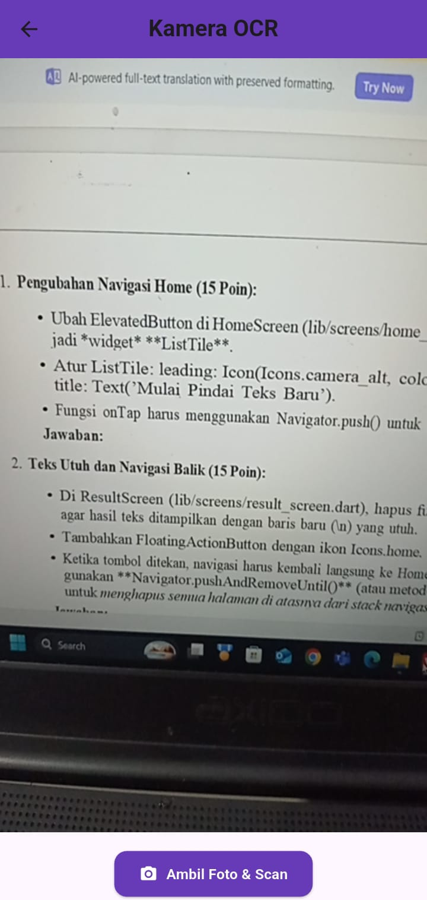
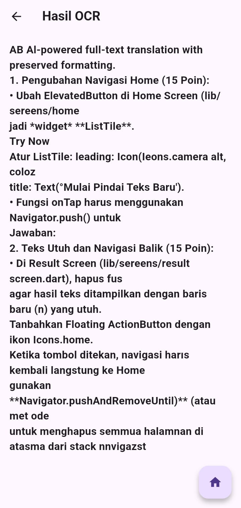
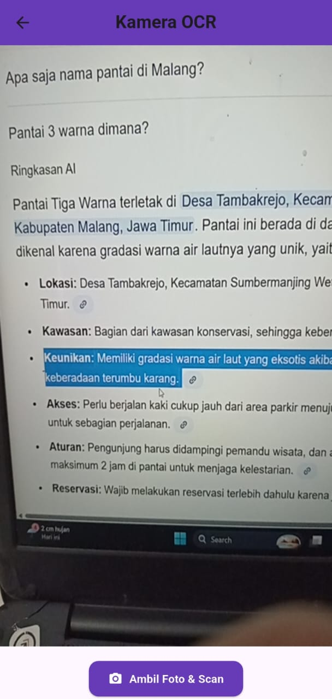
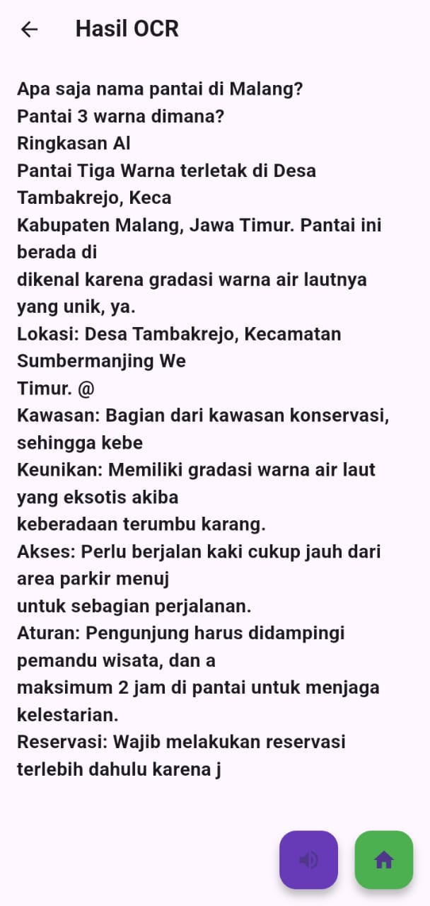

# 📱 OCR Sederhana

Proyek Flutter sederhana untuk melakukan **pengenalan teks (OCR)** dari kamera, serta fitur tambahan seperti pengecekan izin kamera dan *Text-to-Speech (TTS)*.

---

## 🧩 Soal 1 — Implementasi Dasar OCR

Aplikasi berhasil dijalankan di HP dan mampu melakukan pemindaian teks cetak menggunakan kamera melalui plugin **google_mlkit_text_recognition**.  
Hasil teks ditampilkan pada halaman **Hasil OCR**, dengan tombol **Home 🏠** yang berfungsi mengembalikan pengguna ke halaman utama aplikasi.

---

## 📸 Soal 2 — Pengecekan Izin Kamera dan SnackBar Error

Fitur kamera telah dilengkapi pengecekan izin menggunakan **permission_handler**.  
Saat kamera dimuat, muncul teks *“Memuat Kamera... Harap tunggu.”*.  
Jika izin kamera ditolak atau terjadi kesalahan, aplikasi menampilkan **SnackBar berwarna merah** dengan pesan:  
> “Pemindaian Gagal! Periksa izin kamera atau coba lagi.”

---

## 🔊 Soal 3 — Integrasi Fitur Text-to-Speech (TTS)

Aplikasi kini memiliki fitur **Text-to-Speech (TTS)** yang dapat membacakan teks hasil pemindaian secara lisan dalam **bahasa Indonesia**.  
Pada halaman hasil OCR terdapat dua tombol:
- 🔊 **Tombol Suara** untuk memutar bacaan teks, dan  
- 🏠 **Tombol Home** untuk kembali ke halaman utama.  

Fitur TTS berhenti otomatis ketika pengguna keluar dari halaman hasil.

---

📌 **Status:**  
✅ Semua fitur dari Soal 1–3 telah berhasil diimplementasikan dan diuji berjalan dengan baik di perangkat Android.

---
